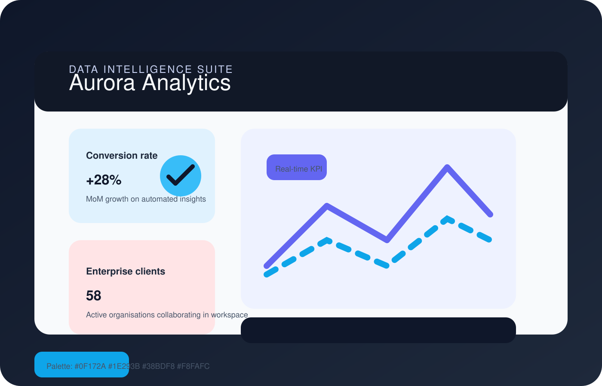
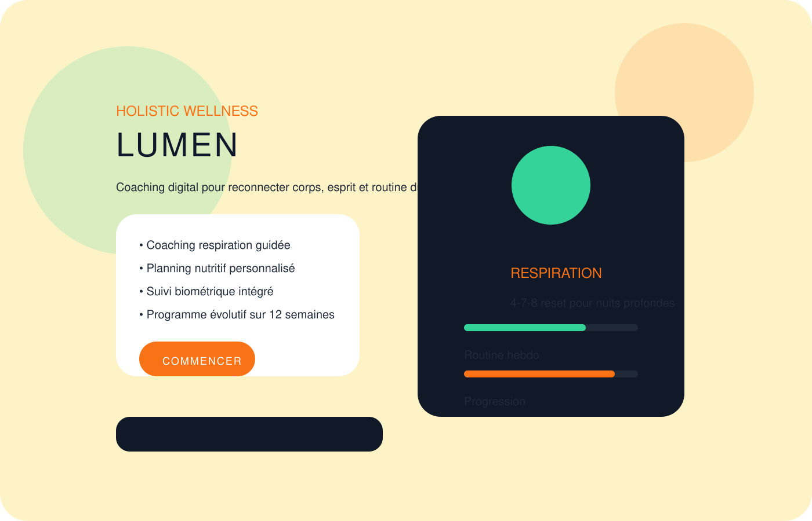
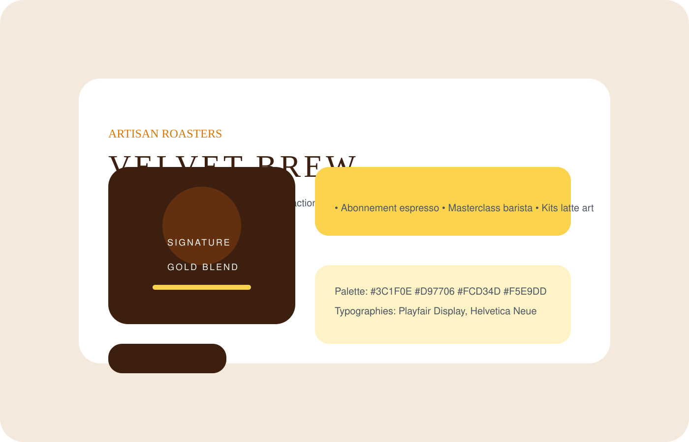

# Portfolio Studio Minimal

Palette directrice : `#0F172A`, `#1E293B`, `#94A3B8`, `#F8FAFC`. Typographies suggérées : **Helvetica Neue**, **Avenir Next**, **Playfair Display**.

---

## Page de couverture

- **Titre** : *Studio Minimal — Design produit & expérience*  
- **Baseline** : Design systems, interfaces et expériences créatives pour les équipes ambitieuses.  
- **Coordonnées clés** :  
  - hello@studiominimal.co  
  - +33 6 12 34 56 78  
  - Paris & remote-first  
- **Accroche visuelle** : Monogramme « SM » en bloc typographique, motif en dégradé bleu nuit ➝ bleu acier, boutons « Découvrir » et « Télécharger le portfolio ».

---

## Présentation

> Nous aidons les SaaS, marques lifestyle et équipes internes à transformer des visions en expériences tangibles. Nous travaillons sur des cycles courts, avec une obsession pour la clarté et les résultats mesurables.

- 12 ans d’expérience en design produit, stratégie brand & prototypage.  
- Méthode **synthèse → maquette → test** sur 2 semaines.  
- Équipe noyau : product designer, brand strategist, creative developer.  
- Réseau partenaire : motion, 3D, copywriting, recherche utilisateur.

---

## Études de cas

### 1. Aurora Analytics — Suite data B2B

- **Contexte** : repositionner un outil d’aide à la décision sur le segment mid-market.  
- **Défi** : clarifier la hiérarchie des dashboards et réduire de 40 % le temps d’onboarding.  
- **Livrables** : audit UX, design system, maquettes haute fidélité, prototypage Figma.  
- **Impact** : +28 % de taux d’adoption sur les comptes pilotes, NPS passé de 21 à 43.  
- **Palette** : #0F172A, #1E293B, #38BDF8, #F8FAFC.  
- **Typos** : Helvetica Neue, IBM Plex Sans.  
- **Logo/visuel** : logotype typographique Aurora Data Lab, KPI cards, graphiques comparatifs.

### 2. Lumen — Application bien-être

- **Contexte** : start-up santé souhaitant lancer une offre hybride coaching & application.  
- **Défi** : créer une identité solaire minimaliste et une expérience mobile apaisante.  
- **Livrables** : identité visuelle, design UI mobile, motion guidelines, pack marketing.  
- **Impact** : +36 % de rétention semaine 4, 4,8★ sur stores après lancement.  
- **Palette** : #FEF3C7, #F97316, #34D399, #111827.  
- **Typos** : Futura, SF Pro.  
- **Logo/visuel** : halo lumineux, bouton CTA circulaire, modules de respiration guidée.

### 3. Nordic Estate — Plateforme d’investissement

- **Contexte** : fonds scandinave souhaitant digitaliser son parcours d’investissement.  
- **Défi** : valoriser l’architecture durable et fluidifier le parcours de décision.  
- **Livrables** : brandbook, maquettes desktop, prototype immersif WebXR, guidelines CRM.  
- **Impact** : +62 % de temps passé sur les visites virtuelles, closing moyen réduit de 3 semaines.  
- **Palette** : #0F172A, #1E293B, #0EA5E9, #E2E8F0.  
- **Typos** : Avenir Next, Neue Haas Grotesk.  
- **Logo/visuel** : monogramme NE, photos immersives, modules comparatifs d’efficacité énergétique.

### 4. Velvet Brew — Marque café premium

- **Contexte** : torréfacteur indépendant lançant une offre e-commerce internationale.  
- **Défi** : exprimer un univers sensoriel sophistiqué sans surcharger l’interface.  
- **Livrables** : direction artistique, templates e-commerce, packshot 3D, kits newsletter.  
- **Impact** : panier moyen +22 %, communauté abonnés +3,5× en six mois.  
- **Palette** : #3C1F0E, #D97706, #FCD34D, #F5E9DD.  
- **Typos** : Playfair Display, Helvetica Neue.  
- **Logo/visuel** : médaillon signature, packaging espresso, CTA « Commander » minimaliste.

---

## Offre tarifaire

| Pack | Positionnement | Inclut | Investissement |
| --- | --- | --- | --- |
| **Essential Sprint** | Lancement d’une fonctionnalité ou mini-brand | 2 ateliers, 1 sprint design, 1 itération UI, livrables Figma + librairie composants | 4 200 € HT |
| **Product Scale** | Produit SaaS ou service digital en croissance | Recherche mixte, roadmap UX, design system complet, prototypes interactifs, kit marketing | 7 800 € HT |
| **Signature Lab** | Refonte globale ou lancement premium | Direction créative, prototypage multi-supports, motion & son, accompagnement go-to-market | 11 500 € HT |

> *Chaque pack inclut un suivi de 30 jours et des ateliers d’appropriation pour les équipes.*

---

## Contact & prochaines étapes

1. **Prise de brief** (30 min) pour cadrer objectifs & indicateurs.  
2. **Atelier d’alignement** avec les équipes (produit, marketing, direction).  
3. **Prototype narratif** livré sous 10 jours ouvrés.  
4. **Coaching de lancement** : scripts, guidelines et kit média.

- **Contact direct** : hello@studiominimal.co  
- **Calendly** : calendly.com/studiominimal/30min  
- **Réseaux** : Behance @studiominimal, LinkedIn /studio-minimal

---

### Mise à jour du portfolio

1. Mettre à jour les maquettes situées dans `docs/portfolio/mockups/`.  
2. Adapter les textes de la section « Études de cas ».  
3. Regénérer le PDF final (voir script associé) pour intégrer les nouvelles sections.

